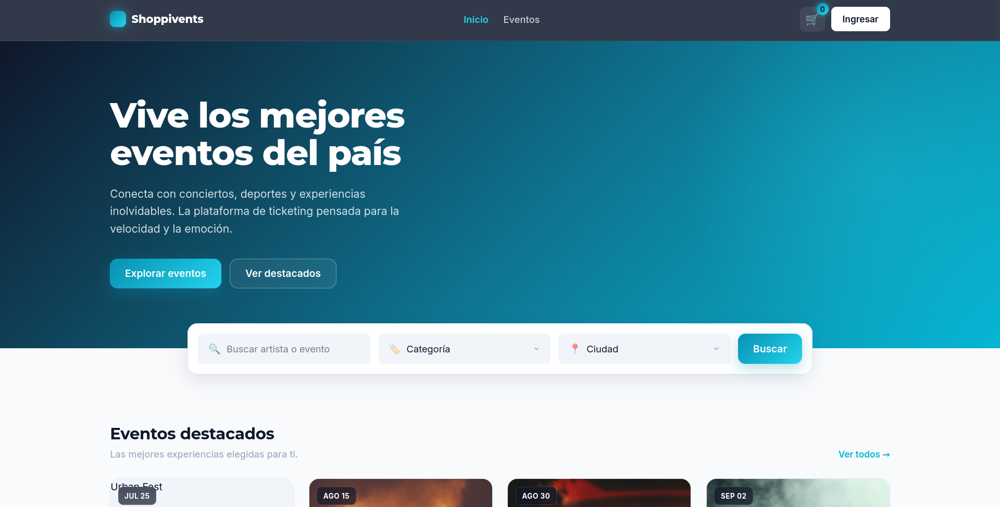
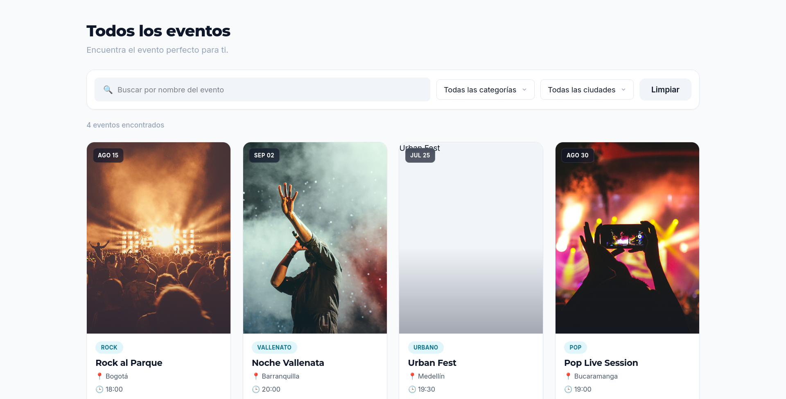
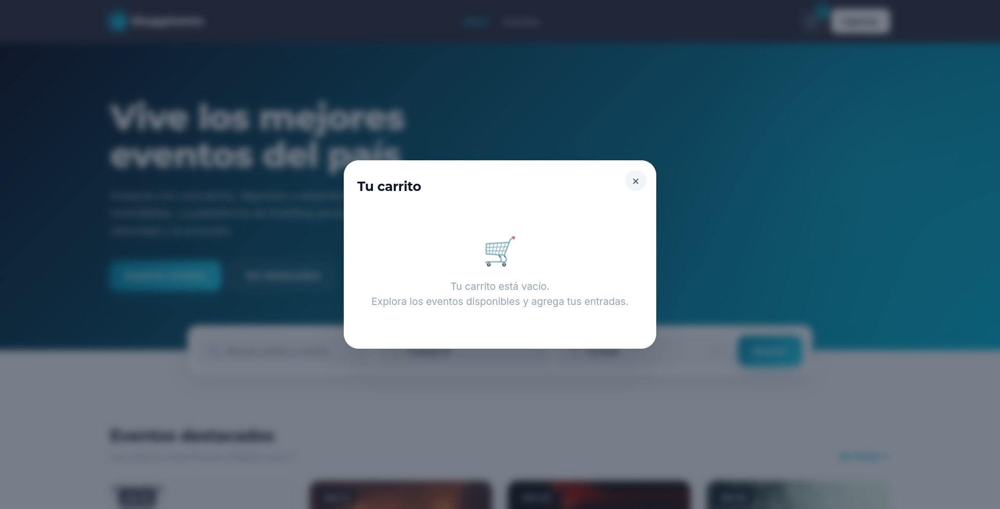
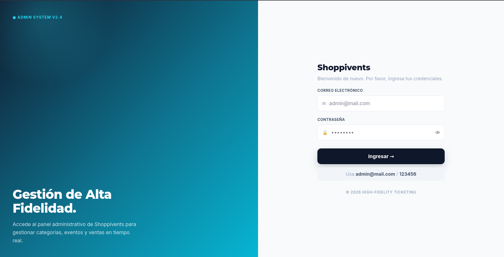

# Shoppivents

Plataforma web de venta de entradas para eventos y conciertos. Permite que un administrador gestione categorías, eventos y ventas, y que los clientes consulten eventos, los agreguen al carrito y realicen una compra simulada.

Construida con **HTML + CSS + JavaScript puro**, sin frameworks. Toda la información se conserva en el navegador usando **localStorage**.

## Integrantes

- Jhorman Fabian Peñaloza Sierra — Front de Administración (login, dashboard, categorías, eventos, ventas) e integración
- Andrés Jiménez — Front de Eventos para Clientes (vista principal, catálogo, detalle, carrito)

## Funcionalidades

### Front de Administración

- **Login** con email `admin@mail.com` y contraseña `123456`. Protege el acceso a los módulos internos.
- **Dashboard** con métricas generales de eventos, tickets, categorías y ganancias, últimas ventas y géneros más populares.
- **Módulo de Categorías**: listar, crear, editar y eliminar categorías con nombre y descripción.
- **Módulo de Eventos**: crear, actualizar y eliminar eventos con código, nombre, categoría, precio, fecha, hora, ciudad (Barranquilla, Bogotá, Bucaramanga, Medellín), imagen y descripción.
- **Módulo de Ventas**: lista de ventas ordenadas de la más reciente a la más antigua, con datos del cliente, ciudad, total y una vista de detalle completo de cada pedido.
- **Reporte de ventas**: consulta las entradas vendidas por evento (código, nombre, cantidad y total) filtrando por año y mes, con la totalización general de todas las ventas del periodo seleccionado.

### Front de Eventos para Clientes

- **Vista principal**: hero, buscador, eventos destacados, categorías y próximos eventos. Es la primera vista pública al abrir la aplicación.
- **Catálogo de eventos**: buscador por nombre en tiempo real más filtros por ciudad y por categoría.
- **Detalle del evento**: imagen ampliada, nombre, descripción, fecha, hora, precio, botón para volver y botón para agregar al carrito.
- **Carrito de compras**: modal con miniatura, nombre, precio, control de cantidad, subtotal y total. Al comprar solicita identificación, nombre, dirección, teléfono y e-mail, y registra la venta con fecha. Muestra confirmación con número de pedido.

### Persistencia

Los datos se guardan en localStorage bajo las claves `categorias`, `eventos`, `ventas`, `carrito` y `sesionAdmin`, serializando con `JSON.stringify()` y recuperando con `JSON.parse()`. El admin y el cliente comparten el mismo almacenamiento: los eventos creados en el panel aparecen en la vista pública y las compras de los clientes se ven en el módulo de ventas.

## Diseño

Sistema de diseño de estética tecnológica de alta fidelidad: paleta anclada en un **azul profundo** (`#0F172A`) con acentos en **cian** (`#06B6D4`), tipografías **Montserrat** para títulos e **Inter** para texto, sombras suaves, chips tipo píldora y tarjetas de eventos con imagen destacada. La vista pública abre directamente en el catálogo de cliente; el acceso administrativo se hace desde el botón Ingresar.

## Estructura del proyecto

```
Proyecto_Concierto_PenalozaJhorman-JimenezAndres/
├── index.html
├── README.md
├── css/
│   ├── shared/        (main, utils, animations)
│   ├── admin/         (layout, components)
│   └── customer/      (layout, components)
└── js/
    ├── app.js
    ├── router.js
    ├── auth.js
    ├── storage.js
    ├── data-seed.js
    ├── components/    (modal, toast, sidebar, creationMenu, loginModal, ...)
    ├── handlers/      (adminHandlers, customerHandlers)
    └── views/
        ├── layouts/   (adminLayout)
        ├── admin/     (dashboard, categories, events, sales)
        └── customer/  (home, events, eventDetail)
```

## Web Components

La interfaz reutiliza componentes personalizados definidos con `customElements.define`. Del lado del administrador: `sidebar-admin`, `admin-layout`, `app-modal`, `app-toast`, `creation-menu`, `login-modal` y las vistas `dashboard-view`, `categories-view`, `events-view`, `sales-view` y `sales-report-view`. Del lado del cliente: `customer-navbar`, `event-card` y `cart-modal`, reutilizando `app-modal` y `app-toast`.

## Diseño responsive

Estilos con enfoque **mobile first** y tres breakpoints (600px, 900px, 1200px). En móvil el sidebar se despliega como menú lateral y las tablas se muestran en formato tarjeta; en escritorio el sidebar es fijo y las tablas se muestran por columnas.

## Capturas de pantalla

### Vista principal (cliente)



### Catálogo de eventos



### Carrito de compras



### Panel de administración



## Instalación y ejecución

1. Clonar el repositorio.
2. Abrir `index.html` con un servidor estático (por el uso de módulos ES). Por ejemplo:

   ```
   python -m http.server 8000
   ```

3. Ingresar a `http://localhost:8000`. La vista pública de clientes carga por defecto; para el panel administrativo, usar el botón **Ingresar** con las credenciales indicadas.
